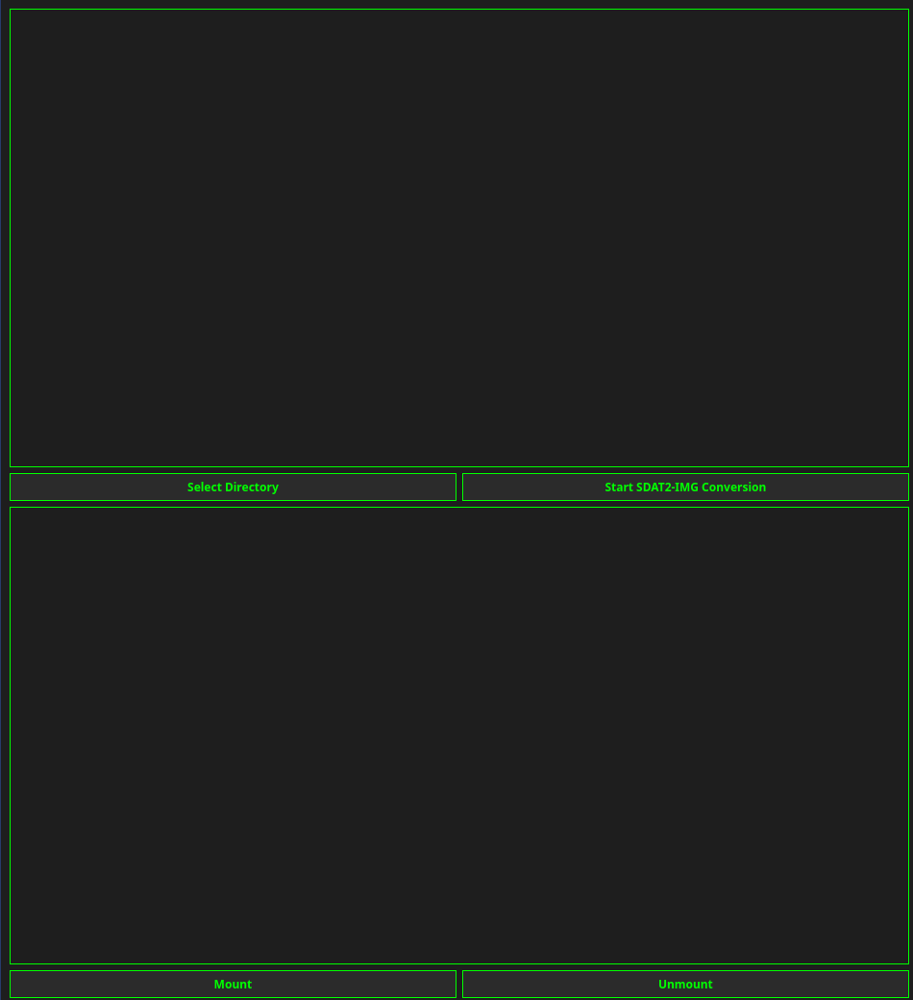

# rom-sdat2img-mounter

## Introduction

Generate part of LOS ( lineage OS ) ROM, lost `modem.bin` or other part's of Rom or Custom rom 
like new `vendor.img` or `system.img`

### Step's

  - Load Uncompressed OTA / Release
  - Start Decompression
  - Select `system.new.img` or `vendor.new.img` --> click Mount / Unmount

### Installation 

`pip install -r requirements`

### OR 

`pip install -r requirements --break-system-packages`

### debian 

`sudo apt install brotli`

### AND 

`sudo apt install XXX what do you need!`
